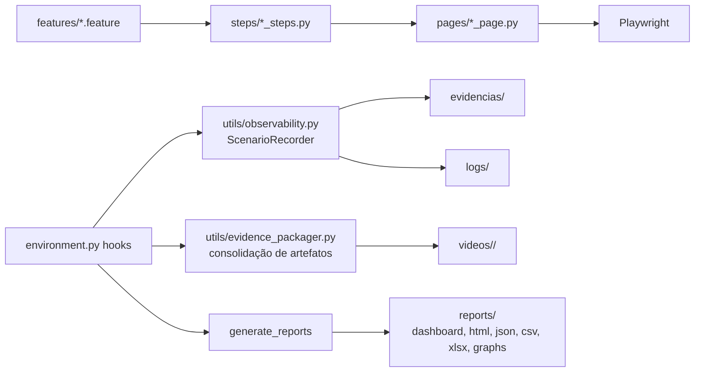

# BugBank — Automação de Testes E2E

Case de Quality Engineering com **Python + Playwright + Behave (BDD)** sobre a aplicação [BugBank](https://bugbank.netlify.app/), incluindo observabilidade, evidências completas por cenário e relatórios executivos com Quality Score.

## Objetivo

Demonstrar uma arquitetura de automação de testes nível sênior/especialista: BDD com Gherkin, Page Object Model, geração automática de evidências (screenshots, vídeos, logs, network, HTML) e reporting executivo para QA Managers, Tech Leads e stakeholders.

## Stack

| Camada | Tecnologia |
|---|---|
| Linguagem | Python 3.11+ |
| Automação Web | Playwright (Chromium via canal `msedge`) |
| BDD | Behave + Gherkin |
| Padrão de projeto | Page Object Model |
| Massa de dados | Faker (pt_BR), contas isoladas por cenário |
| Relatórios | HTML executivo/detalhado, dashboard Plotly + Chart.js, JSON, CSV, XLSX |
| Observabilidade | Console do navegador, network requests, screenshots por step, vídeo por cenário |

## Arquitetura



## Casos de teste (12 cenários)

| ID | Cenário | Funcionalidade |
|---|---|---|
| TC_01 | Criar Conta | Cadastro |
| TC_02 | Acessar a Conta | Login |
| TC_03 | Criar Conta com Saldo Inicial | Cadastro |
| TC_04 | Validar Campos Obrigatórios do Cadastro | Cadastro |
| TC_05 | Cadastrar Conta com E-mail Já Utilizado | Cadastro |
| TC_06 | Cadastrar Conta com Confirmação de Senha Divergente | Cadastro |
| TC_07 | Realizar Login com Senha Inválida | Login |
| TC_08 | Realizar Logout da Aplicação | Login |
| TC_09 | Consultar Saldo da Conta | Extrato |
| TC_10 | Realizar Transferência sem Saldo Suficiente | Transferência |
| TC_11 | Fluxo E2E de Cadastro, Login e Transferência entre Contas | E2E |
| TC_12 | Fluxo E2E Completo de Transferência, Extrato, Saldo e Logout | E2E |

## Evidências por cenário

Cada cenário gera automaticamente:

- **Screenshots**: `01_inicio.png` (início), `02_<step>.png` (antes de cada ação), `03_sucesso.png` ou `failed.png` (final).
- **Vídeo**: consolidado em `videos/<cenário>/video.webm`.
- **Logs**: `execution.log` (metadados + console do navegador), `console.log`, `network.json`.
- **Massa de teste**: `test_data.json` (conta gerada via Faker, senha mascarada).
- **HTML**: `html/page_source.html` (DOM final da página).
- Em falhas: `page.html` e `stacktrace.log` na pasta de evidências.

## Dashboard e relatórios

| Artefato | Descrição |
|---|---|
| reports/dashboard/index.html | Dashboard executivo: KPIs, Quality Score, gráficos Plotly e galeria por cenário (vídeo, screenshots, logs, massa, HTML) |
| reports/html/executive_report.html | Resumo executivo com KPIs e gráfico Pass × Fail |
| reports/html/detailed_report.html | Detalhe por cenário: ID, nome, funcionalidade, status, tempo, data, evidências, vídeo, logs, massa |
| reports/json/execution_results.json | Resultado estruturado da execução |
| reports/json/execution_history.json | Histórico das últimas 20 execuções |
| reports/csv/execution_results.csv | Exportação CSV |
| reports/xlsx/execution_results.xlsx | Exportação Excel (Resumo + Cenários) |
| reports/graphs/ | Gráficos Plotly: pass/fail, cobertura por funcionalidade, tempo por cenário, histórico |

### Quality Score

`score = taxa_de_sucesso - min(10, falhas × 2)`, classificado como **Excellent** (≥90), **Good** (≥75), **Fair** (≥50) ou **Poor** (<50).

## Como executar

```powershell
py -m venv .env
.\.env\Scripts\Activate.ps1
python -m pip install -r requirements.txt
python -m playwright install msedge
behave
```

Execução headless:

```powershell
$env:HEADLESS='1'
behave
```

Variáveis de ambiente: `HEADLESS` (0/1), `BROWSER_CHANNEL` (padrão `msedge`), `TEST_ENVIRONMENT` (rótulo exibido nos relatórios).

## Estrutura de diretórios

```
BugBank/
├── features/          # Gherkin (cadastro, login, transferência, extrato)
├── steps/             # Step definitions Behave
├── pages/             # Page Objects (base, cadastro, login, home, transferência, extrato)
├── utils/             # observability, evidence_packager, logger, screenshot_manager,
│                      # account_context, faker_utils
├── evidencias/        # screenshots, console, network por cenário
├── videos/            # video.webm + screenshots/ + html/ + execution.log + test_data.json
├── logs/              # logs técnicos da execução
├── reports/           # dashboard, html, json, csv, xlsx, graphs, logs
├── environment.py     # hooks Behave
└── playwright.config.py
```

## Diferenciais técnicos

- **Observabilidade completa**: console, pageerror, network e screenshots capturados por listeners do Playwright, sem poluir steps.
- **Consolidação de artefatos**: `evidence_packager` organiza vídeo, screenshots, logs, massa e HTML por cenário via `pathlib`/`shutil`, isolado por try/except (nunca quebra a suíte).
- **Massa isolada e rastreável**: cada cenário usa conta Faker própria, persistida em `test_data.json` com senha mascarada.
- **Reporting em camadas**: JSON/CSV/XLSX para integração, HTML detalhado para QA, dashboard executivo para gestão.
- **Clean Code/SOLID**: responsabilidades separadas entre hooks, recorder, packager e geradores de relatório; hooks reutilizados sem alterar testes.
